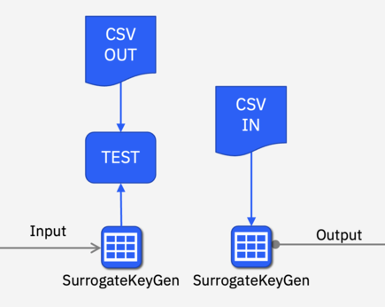

# Testing flows with surrogate key generator stages

Surrogate Key Generators are backed by a Database or a Flat File and will produce output records which are not deterministic.  The use of a Database-backed Surrogate Key Generator will also require a live connection to an external Database which is not ideal for unit testing.  To unit test flow designs containing this type of surrogate key generator, the surrogate key generator stage needs to be removed from the flow and replaced with test case data.  This is done by adding the input link in the `then` clause of the test specification and the output link in the `given` clause.

The CSV input specified by the given clause contains the data that will become the flow of records from the surrogate key generator stage.  The data could simulate what would be produced by the real surrogate key generator if it had processed the test case input records, however it doesn’t have to.  The easiest way to simulate the surrogate key generator output records would be to copy the CSV specified in the `then` clause and add a new column to represent the generated key and set appropriate key values.

### Flow design


### Test specification

```json
{
   "given": [
      {
         "stage": "KeyGenerator",
         "link": "Output",
         "path": "KeyGenerator-Output.csv"
      }
   ],
   "when": {
      "parameters": {
         "MyKeyStartValue": 100
      }
   },
   "then": [
      {
         "stage": "KeyGenerator",
         "link": "Input",
         "path": "KeyGenerator-Input.csv"
      }
   ]
}
```

### Result


