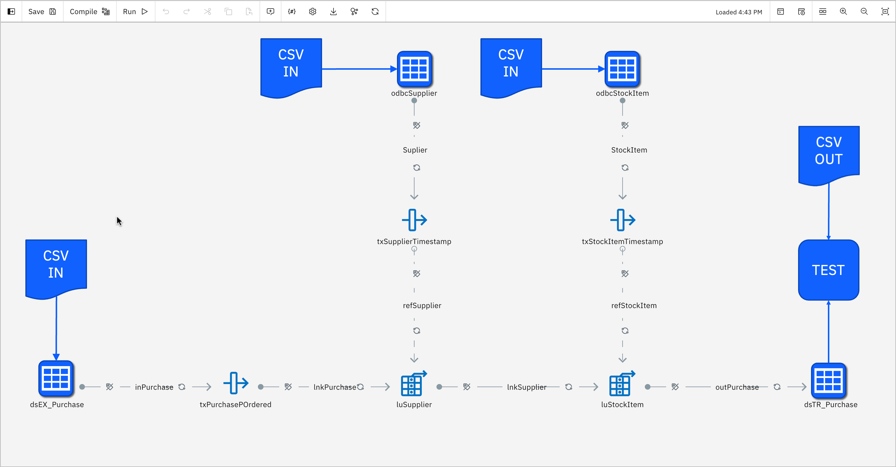

# Executing a DataStage test case

You can execute DataStage® test cases either from the CPD Cluster home page, the DataStage designer canvas, or the DataStage test case editor.

## From the CPD Cluster home page

1. Open an existing project and select the **Jobs** tab.
1. Click the name of the test case you wish to invoke.  This will display the job details panel.
1. Click the **Run job** button in the job details toolbar to invoke the test.
1. When the status icon shows your test has completed click the timestamp to see test results.

## From the DataStage canvas

1. Open an existing DataStage flow for which you have created a test case.
1. Click the **Test cases** icon to  open up the test cases side panel.
1. Click the **Run** icon alongside the name of the test case you wish to invoke.
1. When the status icon shows your test has completed click the timestamp to see test results.

## From the DataStage test case editor

1. Open an existing test case.
1. Click the **Run** button on the toolbar to invoke your test.
1. Click **View result** on the notification that appears when your job is complete.

Once your test is complete you should [verify your test results](verifying-test-results.md).

## Background

When DataStage executes your test case it will dynamically replace your flow's input stages at runtime with components which inject data from the relevant CSV data files into your job on the links specified in [your test specification](test-specification-format.md).  Any source data repositories (files, databases, etc.) included in your test specification will not be connected to or read during a test case execution.

Similarly, your flow's output stage(s) will be replaced at runtime with components which read the incoming data and compare it to the relevant CSV data files containing the output expected on those links.  Any differences are reported in the [test results](verifying-test-results.md).

